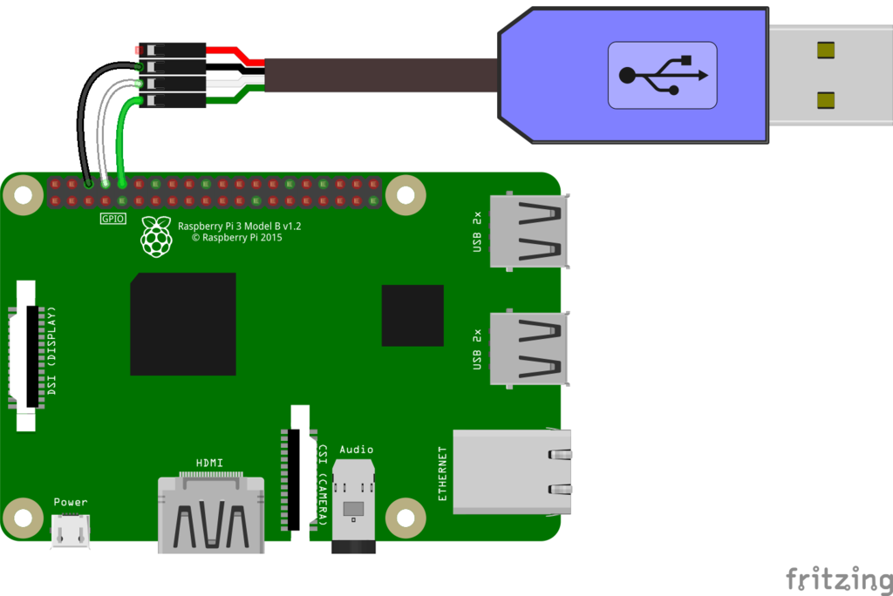
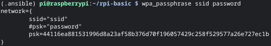
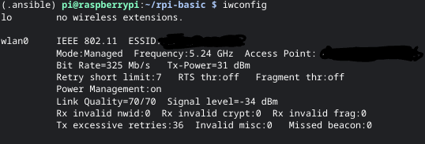

# Basic Setup of a Raspberry Pi

Table of Contents
* [Secure Shell](#secure-shell)
* [Serial Console](#serial-console)
* [Connect Wi-Fi](#connect-wi-fi)
* [Common Setup](#common-setup)

## Secure Shell

Enable remote SSH access by creating an empty file called `ssh` in `/boot`.

## Serial Console

A serial console is useful for boards like the [3A+](https://www.raspberrypi.com/products/raspberry-pi-3-model-a-plus/) which only have a single USB and HDMI port.

Step-by-Step Guide: [learn.adafruit.com/adafruits-raspberry-pi-lesson-5-using-a-console-cable](https://learn.adafruit.com/adafruits-raspberry-pi-lesson-5-using-a-console-cable)

### Requirements

1. USB to Serial cable (e.g, [factoryforward.com/product/pl2303-usb-to-ttl-serial-cable-rs232-module-for-raspberrypi/](https://www.factoryforward.com/product/pl2303-usb-to-ttl-serial-cable-rs232-module-for-raspberrypi/))
2. Add the following line in `/boot/config.txt`,
```
enable_uart=1
```

### Wiring

Wire up the cable as below,
* Black lead to GND (Pin 3)
* White lead to TXD (Pin 4)
* Green lead to RXD (Pin 5)

Reference image from [Adafruit](https://learn.adafruit.com/adafruits-raspberry-pi-lesson-5-using-a-console-cable/connect-the-lead) below,


## Connect Wi-Fi

*Step 1:* Encode the password of your network using the command below. Replace `ssid` and `password` with your network SSID and password respectively.

```
$ wpa_passphrase <ssid> <password>
```



*Step 2:* Identify your network card (e.g, wlan0) using `iwconfig`.

```
$ iwconfig
```



*Step 3:* Create an interface file in `/etc/network/interfaces.d/<wlanid>`
* Replace `<wlanid>` with your network card (e.g, wlan0).
* Replace `<gwip>` with the IP of your router.
* Replace `<ssid>` with your network SSID.
* Replace `<psk>` with the encoded psk from `wpa_passphrase` in step 1 (e.g, 44116ea881531996d8a23af58b376d70f196057429c258f529577a26e727ec1b).

```
auto <wlanid>
iface <wlanid> inet dhcp
        gateway <gwip>
        wpa-ssid <ssid>
        wpa-psk <psk>
```

Use the following reference for a static configuration,
* Replace `<ip>` with the Pi's IP.
* Replace `<nm>` with the netmask of the network.

```
auto <wlanid>
iface <wlanid> inet static
        address <ip>
        netmask <nm>
        gateway <gwip>
        wpa-ssid <ssid>
        wpa-psk <psk>
```
  
*Step 4:* Restart systemd `networking.service` for changes to take effect.

```
$ sudo systemctl restart networking
```

## Common Setup

Use the Ansible playbook below for performing common tasks (e.g, swap, fail2ban),
* ansible__ubuntu-basic
  * GitHub: [github.com/k3karthic/ansible__ubuntu-basic](https://github.com/k3karthic/ansible__ubuntu-basic)
  * Codeberg: [codeberg.org/k3karthic/ansible__ubuntu-basic](https://codeberg.org/k3karthic/ansible__ubuntu-basic)

### Requriements

*Step 1:* Install Python Virtualenv
```
$ sudo apt install virtualenv
```

*Step 2:* Create and enable a virtual environment for Ansible
```
$ virtualenv -p python3 --system-site-packages ~/.ansible
$ . ~/.venv/bin/activate
```

*Step 3:* Install Ansible
```
$ pip install ansible
```

Run the following command to deactivate the Ansible virtualenv,
```
$ deactivate
```
